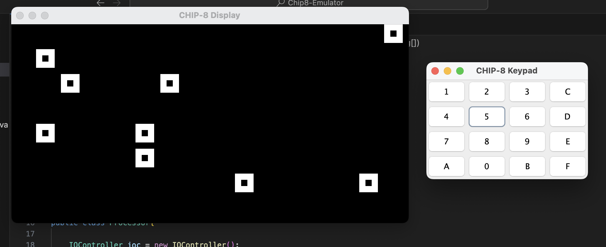
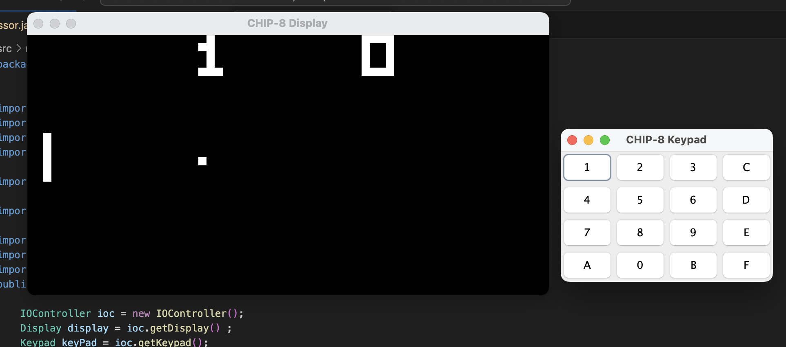
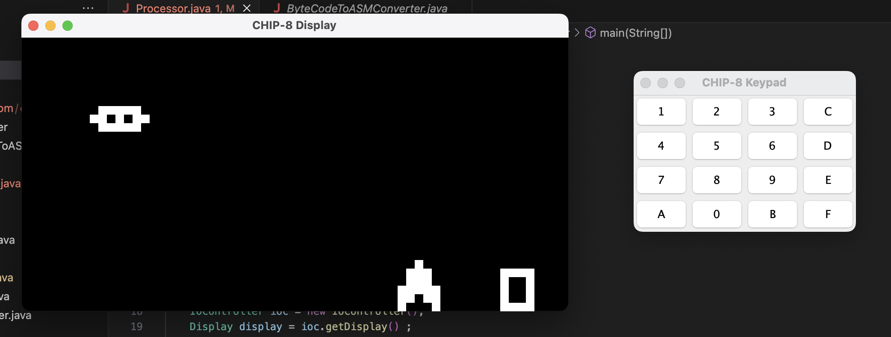

# CHIP-8 Emulator

A fully functional CHIP-8 emulator written in Java, capable of running original CHIP-8 ROMs with accurate CPU emulation, graphical output, keypad input, and audio support.

---

## Screenshots

| AstroDodge — Title Screen | AstroDodge — Gameplay |
|---|---|
|  |  |

| Conway's Game of Life | Pong |
|---|---|
|  |  |

| Rocket |
|---|
|  |

---

## Features

- **Full CHIP-8 CPU** — All 35 standard opcodes implemented
- **64×32 Display** — Rendered via Java Swing at 10× scale (640×320 window)
- **Keypad Input** — 16-key hex keypad with both synchronous and asynchronous input modes
- **Sound** — Optional beep audio via system toolkit
- **Delay & Sound Timers** — Accurate 60 Hz timer decrement
- **Built-in Disassembler** — Optional real-time opcode-to-assembly translation printed to console
- **Sprite Rendering** — Full XOR-based sprite drawing with collision detection
- **ROM Loader** — Loads any standard `.ch8` ROM file from disk

---

## Project Structure

```
com.chip8/
├── engine/
│   ├── Processor.java       # CPU — fetch, decode, execute loop
│   └── Settings.java        # Global configuration constants
├── peripherals/
│   ├── input/
│   │   └── Keypad.java      # 16-key hex keypad (Swing)
│   └── output/
│       ├── Display.java     # 64×32 pixel display (JPanel)
│       └── Sound.java       # System beep audio
├── disassembler/
│   └── ByteCodeToASMConverter.java  # Opcode → assembly string
└── rom/
    └── RomReader.java       # ROM file loader into memory
```

---

## Getting Started

### Prerequisites

- Java 8 or higher
- Any standard CHIP-8 ROM file (`.ch8`)

### Configuration

Edit `Settings.java` before running:

```java
// Path to your ROM file
public static final String ROM_PATH = "path/to/your/rom.ch8";

// Pixel color for "on" pixels
public static final Color SET_COLOR = Color.GREEN;

// Print disassembly to console
public static final boolean DISASSEMBLE_ASM = true;

// Enable audio
public static final boolean AUDIO = false;
```

### Running

Compile and run the project from your IDE or via the command line:

```bash
javac -d out src/**/*.java
java -cp out com.chip8.engine.Processor
```

---

## CHIP-8 Technical Details

| Property | Value |
|---|---|
| Memory | 4 KB (4096 bytes) |
| Registers | 16 × 8-bit general-purpose (V0–VF) |
| Program Start | `0x200` |
| Sprite Storage | `0x100` |
| Display | 64 × 32 pixels |
| Stack | Variable depth (Java `Stack<Integer>`) |
| Timers | Delay + Sound (60 Hz decrement) |
| CPU Speed | ~500 instructions/sec (8 instructions per 16 ms cycle) |
| Refresh Rate | 60 Hz |

### Keypad Mapping

The CHIP-8 uses a 16-key hex keypad. Map your physical keys to the following layout:

```
CHIP-8 Key   →   Keyboard
-----------       --------
1 2 3 C          1 2 3 4
4 5 6 D          Q W E R
7 8 9 E          A S D F
A 0 B F          Z X C V
```

---

## Supported Opcodes

| Opcode | Description |
|---|---|
| `00E0` | Clear display |
| `00EE` | Return from subroutine |
| `1NNN` | Jump to address NNN |
| `2NNN` | Call subroutine at NNN |
| `3XNN` | Skip if VX == NN |
| `4XNN` | Skip if VX != NN |
| `5XY0` | Skip if VX == VY |
| `6XNN` | Set VX = NN |
| `7XNN` | Add NN to VX |
| `8XY0–E` | Arithmetic & bitwise ops (OR, AND, XOR, ADD, SUB, SHR, SUBN, SHL) |
| `9XY0` | Skip if VX != VY |
| `ANNN` | Set index register I = NNN |
| `BNNN` | Jump to NNN + V0 |
| `CXNN` | Set VX = random byte AND NN |
| `DXYN` | Draw N-byte sprite at (VX, VY), set VF on collision |
| `EX9E` | Skip if key VX is pressed |
| `EXA1` | Skip if key VX is not pressed |
| `FX07` | Set VX = delay timer |
| `FX0A` | Wait for keypress, store in VX |
| `FX15` | Set delay timer = VX |
| `FX18` | Set sound timer = VX |
| `FX1E` | Add VX to I |
| `FX29` | Set I = sprite address for digit VX |
| `FX33` | Store BCD of VX in memory at I, I+1, I+2 |
| `FX55` | Store V0–VX in memory starting at I |
| `FX65` | Read V0–VX from memory starting at I |

---

## License

This project is licensed under the MIT License. See [LICENSE.md](LICENSE.md) for details.
